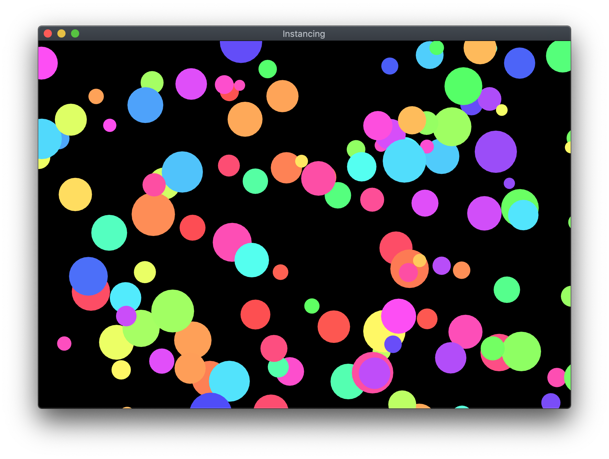

# Simple Instancing with Metal in Swift

This is an extremely basic demonstration of instanced drawing, including how to animate instances and how to use vertex descriptors in concert with instancing to automatically fetch per-instance data in the vertex shader.

## Usage

In Bridging-Header.h, set `USE_VERTEX_DESCRIPTOR` to 1 or 0, to enable or disable vertex descriptors respectively.  
Build and run

## Screenshot

## Requirements

Xcode 11 or newer  
macOS 10.15 Catalina or newer
